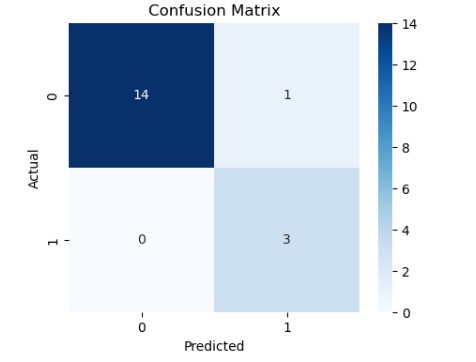
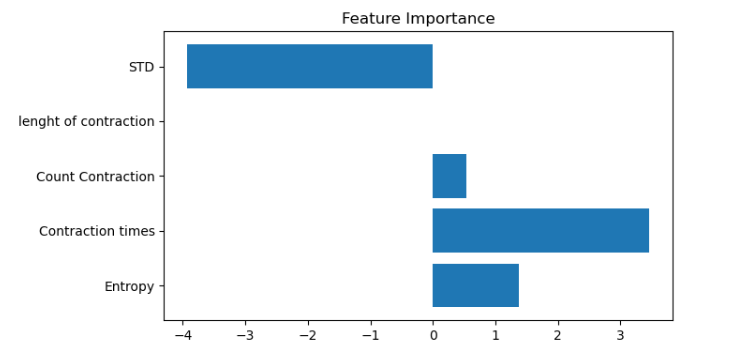

<div align="center">

# 👶 Preterm Birth Prediction using Machine Learning

### Healthcare Prediction System using Logistic Regression


</div>

---

# 📌 Project Overview

This project predicts the probability of **Preterm Birth** using Machine Learning techniques.

The model analyzes medical parameters and performs prediction using **Logistic Regression**.

The project demonstrates:

✔ Data preprocessing

✔ Feature scaling

✔ Logistic Regression

✔ Prediction and evaluation

✔ Healthcare analytics

---

# 🩺 Features Used

Input Features:

| Feature | Description |
|----------|-------------|
| Entropy | Medical parameter |
| Contraction times | Number of contractions |
| Count Contraction | Contraction count |
| Length of Contraction | Duration of contraction |
| STD | Standard deviation feature |

Target Variable:

```text
Pre-term
```

---

# ⚙ Data Preprocessing

Performed operations:

✔ Missing value checking

✔ Min-Max Feature Scaling

✔ Train-Test Split

✔ Feature selection

---

# 🤖 Machine Learning Model

Model Used:

```text
Logistic Regression
```

Parameters used:

```python
penalty = "l1"

C = 3

solver = "liblinear"
```

---

# 📊 Model Performance

| Metric | Value |
|---------|--------|
| Accuracy | 94.44% |
| Precision | 96% |
| Recall | 94% |
| Weighted F1 Score | 95% |

---

# 📈 Classification Report

```text
precision recall f1-score support

0 1.00 0.93 0.97 15

1 0.75 1.00 0.86 3

Accuracy = 0.9444
```

---

# 📊 Output Visualizations

## Confusion Matrix



---

## Feature Importance



---

# 📁 Project Structure

```text
Preterm_Birth_Prediction/
│
├── Preterm_Birth_Prediction.ipynb
├── Preterm_Birth_Prediction.py
├── preterm_birth_dataset.csv
├── requirements.txt
├── confusion_matrix.png
├── feature_importance.png
└── README.md
```

---

# 🔮 Future Improvements

🚀 Web deployment using Streamlit

🚀 Advanced healthcare models

🚀 Real-time monitoring system

🚀 Deep Learning integration

---

<div align="center">

### Developed as a Healthcare Machine Learning Project

**BTech CSE (AI & ML)**

</div>
